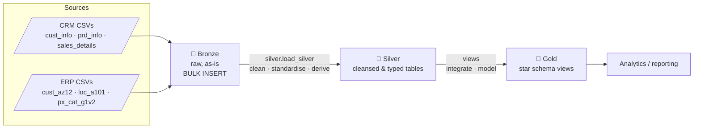
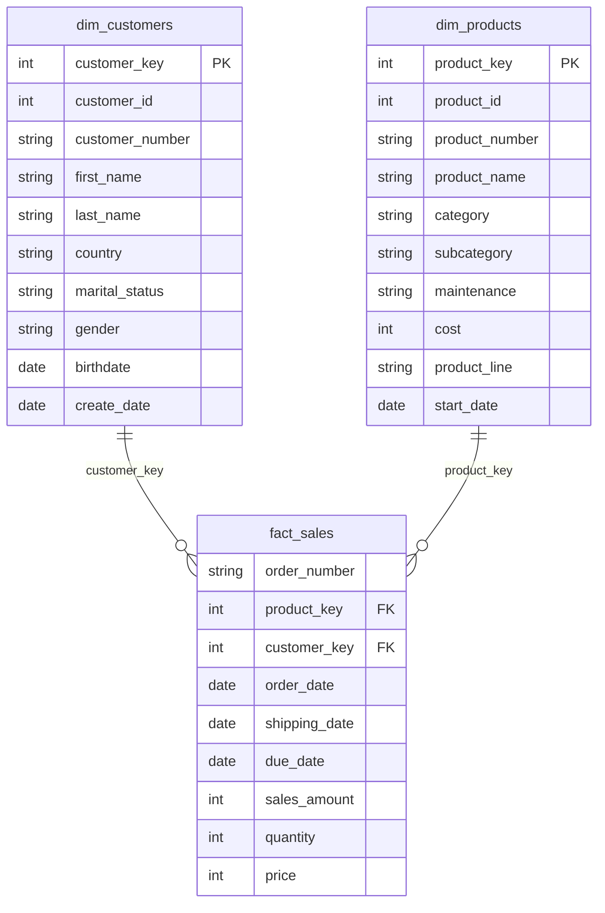

# SQL Data Warehouse — Medallion Architecture (SQL Server)

A modern data warehouse built on **SQL Server** that consolidates **CRM** and **ERP** sales data
through an **ETL pipeline** into analytics-ready datasets. It follows the **Medallion Architecture**
(Bronze → Silver → Gold), processes **65K+ sales records**, converts **6 source datasets**
from bronze to silver using **CTEs and stored procedures**, and exposes a **star schema** with
**3 analytics-ready datasets** in the gold layer.

> **Data note:** the CSV files in `datasets/` are **synthetic**, generated by
> `scripts/generate_sample_data.py` (fixed seed, reproducible). They mimic a CRM + ERP bike-retail
> system and deliberately contain duplicates, NULL keys, stray whitespace, coded values, invalid
> dates and inconsistent sales figures so the cleansing logic has real work to do.

## Architecture



| Layer | Object type | Load | Transformations |
|-------|-------------|------|-----------------|
| **Bronze** | Tables | Full refresh (`TRUNCATE` + `BULK INSERT`) via `bronze.load_bronze` | None (raw copy) |
| **Silver** | Tables | Full refresh via `silver.load_silver` | Cleansing, standardisation, de-duplication, derived columns |
| **Gold** | Views | n/a (always current) | Integration of CRM + ERP, business naming, surrogate keys, star schema |

### Gold star schema



### Silver transformations

| Table | Rules |
|-------|-------|
| `crm_cust_info` | Drop NULL ids · keep latest row per `cst_id` (CTE + `ROW_NUMBER`) · `TRIM` names · decode `S/M` → Single/Married and `F/M` → Female/Male · unknown → `n/a` |
| `crm_prd_info` | Split `prd_key` into `cat_id` + `prd_key` · NULL cost → 0 · decode product line · rebuild end date with `LEAD()` (CTE) |
| `crm_sales_details` | `yyyymmdd` ints → `DATE` (0 / bad length → NULL) · rebuild sales/price when NULL, ≤ 0 or ≠ quantity × price (CTE) |
| `erp_cust_az12` | Strip `NAS` prefix from `cid` · future birthdates → NULL · normalise gender |
| `erp_loc_a101` | Strip `-` from `cid` · normalise country (`DE` → Germany, `US`/`USA` → United States, blank → n/a) |
| `erp_px_cat_g1v2` | Loaded as-is (already clean) |

## Repository layout

```
├── datasets/                  # synthetic source files (source_crm/, source_erp/)
├── scripts/
│   ├── init_database.sql      # creates DataWarehouse + bronze/silver/gold schemas
│   ├── bronze/                # ddl_bronze.sql, proc_load_bronze.sql
│   ├── silver/                # ddl_silver.sql, proc_load_silver.sql
│   ├── gold/                  # ddl_gold.sql (dim_customers, dim_products, fact_sales)
│   ├── generate_sample_data.py
│   └── run_pipeline.sh        # one-command run against the Docker container
├── tests/                     # quality_checks_*.sql, test_sample_data.py
├── docs/                      # data catalog, naming conventions
├── docker-compose.yml         # local SQL Server 2022
└── .github/workflows/ci.yml   # data-contract tests
```

## Getting started

**Requirements:** Docker (or any SQL Server 2019+ instance), and optionally Azure Data Studio / SSMS to explore.

### Option A — Docker (macOS / Linux / Windows)

```bash
cp .env.example .env          # set a strong SA password
docker compose up -d          # wait ~20 s for SQL Server to start
./scripts/run_pipeline.sh     # builds the DB, loads bronze -> silver, creates gold, runs checks
```

Connect from Azure Data Studio: server `localhost,1433`, user `sa`, password from `.env`,
database `DataWarehouse`. Then:

```sql
SELECT TOP 10 * FROM gold.fact_sales;
```

### Option B — existing SQL Server instance

1. Run, in order: `scripts/init_database.sql`, `scripts/bronze/ddl_bronze.sql`,
   `scripts/bronze/proc_load_bronze.sql`, `scripts/silver/ddl_silver.sql`,
   `scripts/silver/proc_load_silver.sql`, `scripts/gold/ddl_gold.sql`.
2. Make `datasets/` readable **by the SQL Server service** (the server reads the files, not your client), then:
   ```sql
   EXEC bronze.load_bronze @data_path = N'C:\path\to\datasets\';  -- must end with a separator
   EXEC silver.load_silver;
   ```
3. Validate with `tests/quality_checks_silver.sql` and `tests/quality_checks_gold.sql`
   (every check should return **no rows**, except the informational `DISTINCT` lists and the gold summary).

### Regenerating the data

```bash
python scripts/generate_sample_data.py     # Python 3.8+, standard library only
python -m unittest discover -s tests -v    # verifies the file contract and key alignment
```

## Example analysis

```sql
-- Revenue by category and year
SELECT p.category, YEAR(f.order_date) AS order_year, SUM(f.sales_amount) AS revenue
FROM gold.fact_sales f
JOIN gold.dim_products p ON p.product_key = f.product_key
WHERE f.order_date IS NOT NULL
GROUP BY p.category, YEAR(f.order_date)
ORDER BY order_year, revenue DESC;
```

## Design notes

- **Full-refresh loads** keep the project simple and idempotent; incremental loading would be the next step.
- **Gold is views**, so it always reflects silver. `dim_products` keeps only the *current* product version (no history).
- **Order dates that are invalid in the source become NULL** in silver (and in gold `order_date`) rather than being guessed.
- **Documentation links:** add your Notion data-flow/integration map and Miro star-schema diagram here.
  - Notion: _\<link\>_
  - Miro: _\<link\>_

## License

MIT — see [LICENSE](LICENSE).
