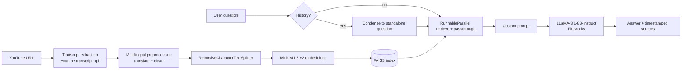

# 🎬 YouTube Transcript Chatbot | Retrieval-Augmented Generation

An end-to-end chatbot that lets you ask questions about any YouTube video. It extracts the video transcript,
cleans and chunks it, indexes it in FAISS, and answers with **LLaMA-3.1-8B-Instruct (Fireworks)** through a
modular **LangChain RAG pipeline**, with timestamped sources you can click to jump to the exact moment.

## Features

- **Transcript extraction** with `youtube-transcript-api` (manual captions preferred over auto-generated).
- **Multilingual preprocessing**: transcripts in other languages are translated to English (matching the
  English embedding model), text is Unicode-normalised, and noise such as `[Music]` is removed.
- **Recursive chunking** with `RecursiveCharacterTextSplitter` (sentence-aware separators for Latin, Devanagari and CJK text).
- **Semantic search** using Hugging Face `all-MiniLM-L6-v2` embeddings and a **FAISS** vector store (MMR retrieval).
- **LangChain RAG pipeline** using fully custom prompts, **runnables** (`RunnablePassthrough`, `RunnableLambda`,
  `RunnableBranch`) and **parallel chains** (`RunnableParallel`) for retrieval and pass-through of question/history.
- **Follow-up questions**: a condense step rewrites context-dependent questions into standalone ones before retrieval.
- **Timestamped sources** with deep links into the video.
- **Two interfaces**: Streamlit web app and a CLI.
- **Disk cache** of FAISS indexes, so re-opening a video is instant.

## Architecture



## Quick start

Requires **Python 3.10+** and a free [Fireworks AI API key](https://fireworks.ai/account/api-keys).

```bash
git clone https://github.com/<your-username>/youtube-transcript-chatbot.git
cd youtube-transcript-chatbot

python -m venv .venv
source .venv/bin/activate          # Windows: .venv\Scripts\activate
pip install -r requirements.txt

cp .env.example .env               # Windows: copy .env.example .env
# edit .env and set FIREWORKS_API_KEY
```

### Web app

```bash
streamlit run app.py
```

Paste a YouTube link in the sidebar, click **Load video**, then chat. The first run downloads the
~90 MB embedding model from Hugging Face.

### Command line

```bash
python main.py "https://www.youtube.com/watch?v=VIDEO_ID"                 # interactive chat
python main.py VIDEO_ID -q "What are the key takeaways?" --sources        # one-shot with sources
```

Options: `-k/--top-k`, `--sources`, `--no-cache`.

## Configuration

All settings are environment variables (see `.env.example`).

| Variable | Default | Description |
|---|---|---|
| `FIREWORKS_API_KEY` | none (required) | Fireworks AI API key |
| `FIREWORKS_MODEL` | `accounts/fireworks/models/llama-v3p1-8b-instruct` | Model ID on Fireworks. Change it if Fireworks renames or retires the model |
| `EMBEDDING_MODEL` | `sentence-transformers/all-MiniLM-L6-v2` | Hugging Face embedding model |
| `CHUNK_SIZE` / `CHUNK_OVERLAP` | `800` / `150` | Characters per chunk / overlap |
| `TOP_K` | `4` | Chunks retrieved per question |
| `TEMPERATURE` / `MAX_TOKENS` | `0.2` / `512` | LLM generation settings |
| `PREFERRED_LANGUAGES` | `en` | Transcript languages used as-is (comma-separated) |
| `TARGET_LANGUAGE` | `en` | Other languages are translated into this (`""` disables translation) |
| `CACHE_DIR` | `.cache/indexes` | Where FAISS indexes are cached |

## Project structure

```
youtube-transcript-chatbot/
├── app.py                  # Streamlit UI
├── main.py                 # CLI
├── yt_chatbot/
│   ├── config.py           # Settings from env / .env
│   ├── utils.py            # Video-id parsing, timestamps
│   ├── transcript.py       # Transcript fetching + multilingual selection/translation
│   ├── preprocessing.py    # Cleaning + recursive chunking with timestamps
│   ├── vectorstore.py      # MiniLM embeddings + FAISS helpers
│   ├── prompts.py          # Custom QA and condense prompts
│   ├── chain.py            # LCEL runnables, parallel chains, chatbot class
│   ├── pipeline.py         # URL -> index (with disk cache)
│   └── errors.py           # User-facing exceptions
├── tests/                  # pytest suite (no network / API key needed)
├── .github/workflows/ci.yml
├── requirements.txt / requirements-dev.txt
├── .env.example
└── LICENSE
```

## Tests

```bash
pip install -r requirements-dev.txt
python -m pytest
```

Tests use fake embeddings, a fake LLM and a mocked YouTube API, so they run offline.

## Limitations and troubleshooting

- **Videos without captions** (or with subtitles disabled) cannot be processed.
- **"YouTube blocked the request"**: YouTube often blocks cloud/VPN IP addresses. Run locally on a normal
  connection, or configure a proxy as described in the
  [youtube-transcript-api docs](https://github.com/jdepoix/youtube-transcript-api).
- **Non-English questions**: the answer follows the question's language, but retrieval quality is best in
  English because MiniLM-L6-v2 is an English model. Set `EMBEDDING_MODEL` to a multilingual model
  (e.g. `sentence-transformers/paraphrase-multilingual-MiniLM-L12-v2`) and `TARGET_LANGUAGE=""` to work natively.
- Answers are grounded only in the transcript; if the answer is not there the bot says so.
- The FAISS cache is loaded with pickle deserialization, which is safe for indexes this app wrote itself;
  do not put untrusted index files in `CACHE_DIR`.

## License

MIT, see [LICENSE](LICENSE). Replace `[Your Name]` in the license with your name before publishing.
